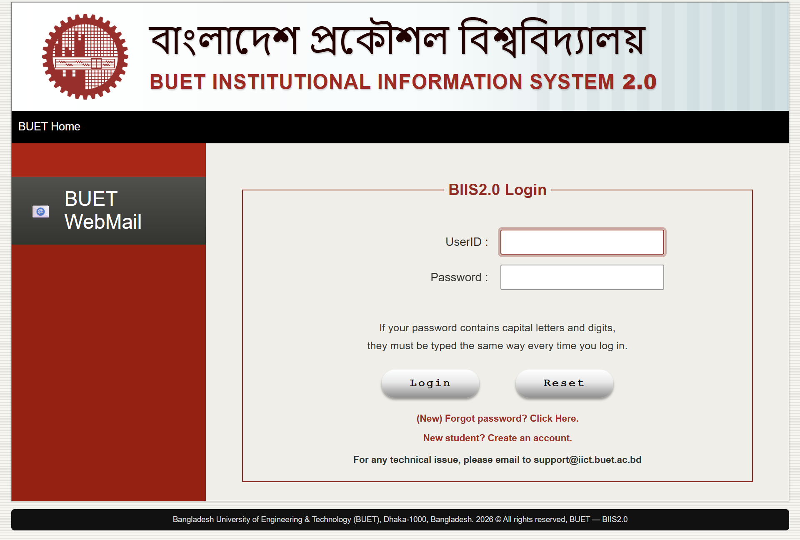
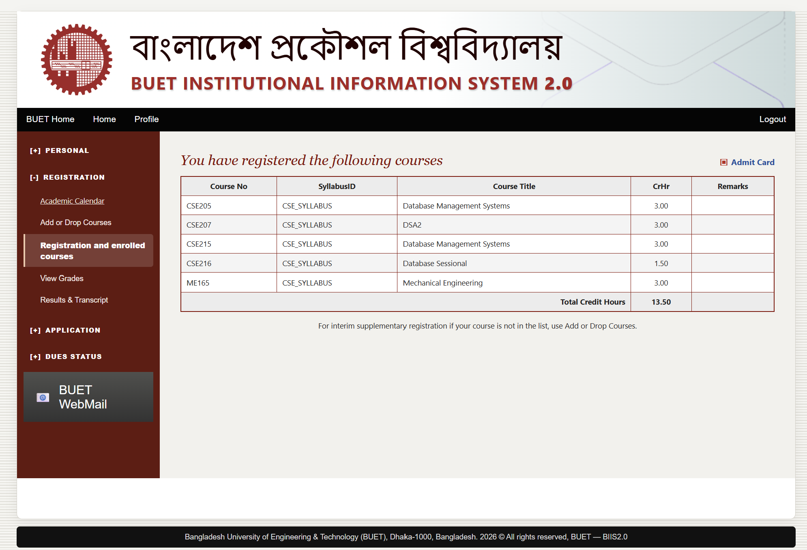
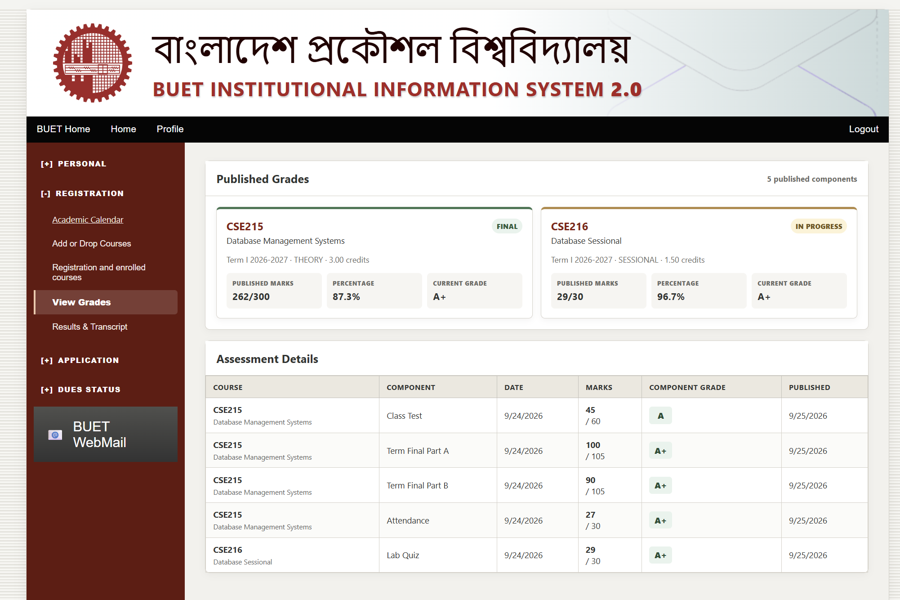
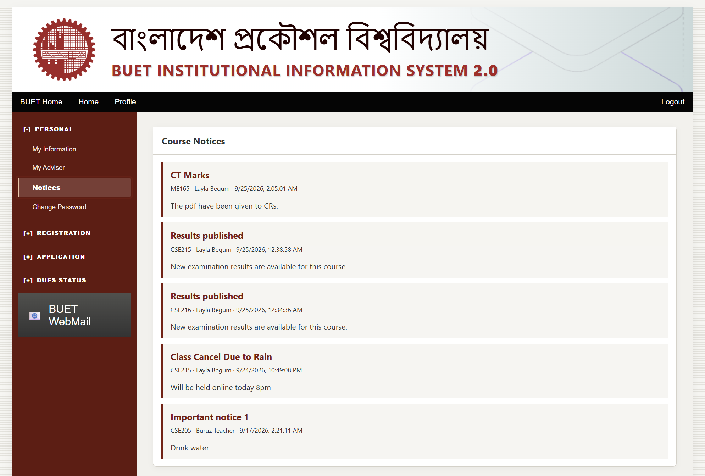
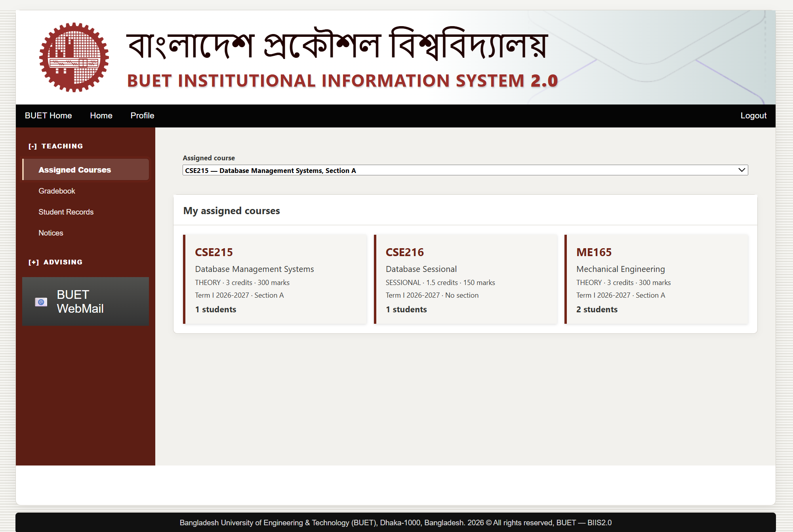
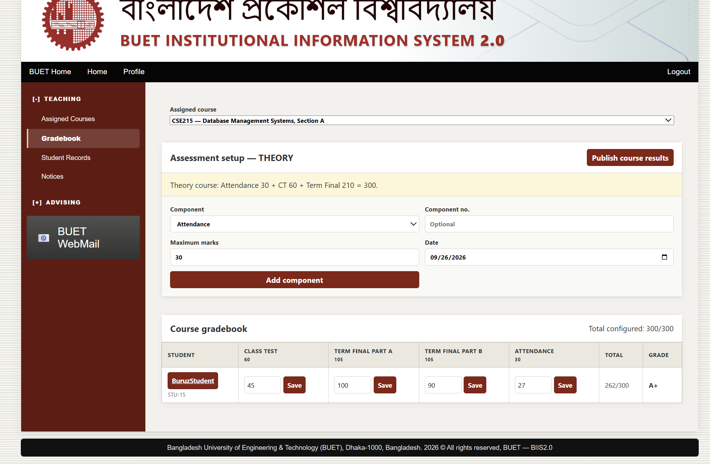
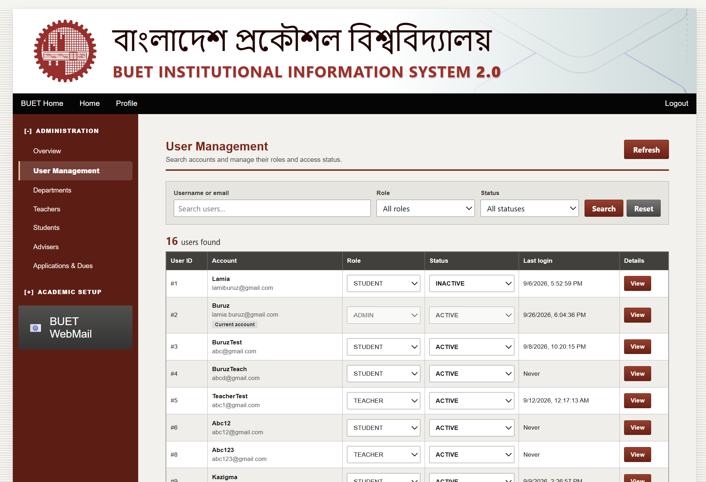
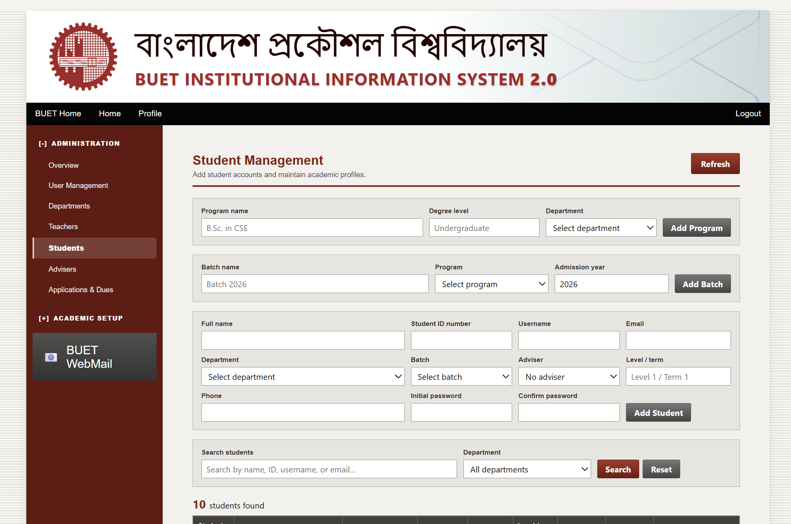
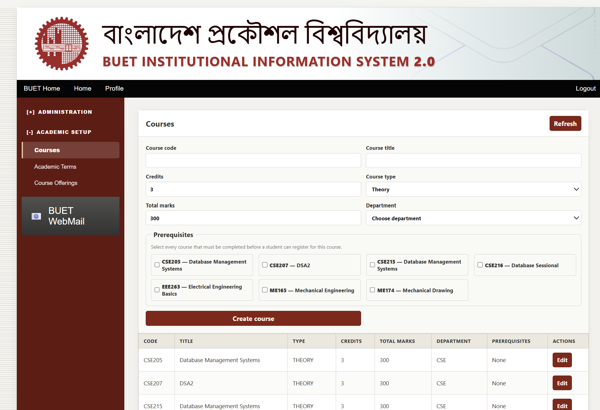

<div align="center">

# BUET Institutional Information System 2.0

### A Full-Stack Recreation of the BUET Institutional Information System

**CSE 216 — Database Sessional Project**

Bangladesh University of Engineering and Technology  
Department of Computer Science and Engineering

<br>

[Original BUET BIIS](https://biis.buet.ac.bd/) · [Source Repository](https://github.com/Typhon13/BIIS-2.0)

</div>

---

## About the Project

**BUET Institutional Information System 2.0 (BIIS 2.0)** is a full-stack academic information management system developed as part of the CSE 216 Database Sessional project.

The project is inspired by and recreates the structure, visual language, and principal academic workflows of the existing **BUET Institutional Information System (BIIS)** while implementing the underlying system using a contemporary web application architecture.

BIIS 2.0 brings student, teacher, and administrative operations into a single database-driven platform. It covers the academic lifecycle from course creation and prerequisite configuration to course registration, teacher assignment, assessment, grade publication, notices, and student records.

The objective was not to replace the character of the original BIIS interface with an unrelated modern dashboard. Instead, the project preserves its recognizable institutional presentation while rebuilding its functionality around a structured frontend, REST API, and relational database.

> **Reference system:** [BUET Institutional Information System](https://biis.buet.ac.bd/)
>
> BIIS 2.0 is an independent academic recreation created for coursework. It is not the official BUET BIIS service and is not affiliated with or endorsed by Bangladesh University of Engineering and Technology.

---

## System at a Glance

BIIS 2.0 provides separate interfaces and permissions for the three principal actors of an academic information system:

| Role | Principal Responsibilities |
| --- | --- |
| **Student** | Registration, enrolled courses, grades, results, notices, applications, dues and academic information |
| **Teacher** | Assigned courses, student records, assessment configuration, grade entry, result publication and notices |
| **Administrator** | Users, students, teachers, departments, advisers, courses, prerequisites, terms and course offerings |

The individual modules share a common database, allowing operations performed by one role to become part of the workflow of another.

---

# Interface

## Authentication

The authentication interface deliberately follows the visual identity of the original BUET BIIS system.

Users authenticate through a common login page and are subsequently provided with functionality appropriate to their account role.

<p align="center">
  
</p>

---

# Student Portal

The student portal provides access to the academic information and services relevant to an individual student.

Its functionality includes course registration, enrolled-course information, published assessment results, academic notices, applications, dues information, adviser details, and account management.

## Registration and Enrolled Courses

Students can inspect the courses for which they are currently registered.

Each registration contains the relevant course number, syllabus information, course title and credit hours, with the total registered credit load calculated by the system.

<p align="center">
  
</p>

Registration is connected to actual course offerings rather than merely to static course definitions. This allows term, teacher, section, prerequisite, and enrollment information to remain consistent throughout the application.

---

## Published Grades

The student grade interface provides both a concise course-level overview and the underlying assessment details.

<p align="center">
  
</p>

Students can inspect:

- published assessment components;
- marks obtained and maximum marks;
- component grades;
- aggregate marks;
- percentage;
- current course grade;
- publication information; and
- whether assessment for the course is complete or still in progress.

Results only become available through the student interface after publication by the responsible teacher.

---

## Course Notices

Course-related communication is integrated into the student portal.

<p align="center">
  
</p>

Notices retain their association with the relevant course and teacher, allowing students to distinguish general announcements from information relating to a particular enrolled course.

Result publication can also generate appropriate course notifications.

---

# Teacher Portal

The teacher interface is organized around assigned course offerings.

Teachers can access their courses, enrolled students, academic records, assessment configuration, gradebook functionality, result publication, and course notices without being given administrative access to unrelated institutional data.

## Assigned Courses

<p align="center">
  
</p>

The assigned-course view presents information including:

- course code and title;
- course type;
- credit hours;
- total marks;
- academic term;
- section information; and
- number of enrolled students.

The system supports the assignment of multiple teachers to a course offering when required.

Theory and sessional courses are also handled separately. In particular, sessional courses are not forced into the conventional theory-course section model.

---

## Gradebook and Assessment Management

Assessment is modeled as a collection of configurable components rather than as a single final-mark field.

<p align="center">
  
</p>

A teacher can configure assessment components, enter individual student marks, inspect calculated totals and grades, and ultimately publish the result of a course.

For a theory course, an assessment structure may contain components such as:

```text
Attendance
Class Test
Term Final Part A
Term Final Part B
```

A sessional course can use an assessment structure appropriate to laboratory work, including components such as quizzes, lab performance, projects, reports, or viva examinations.

The configured assessment components must collectively correspond to the marks available for the course.

This approach keeps the assessment model flexible while maintaining the total-mark constraints defined for each course.

---

# Administration

The administrative portal forms the management layer of BIIS 2.0.

Administrators maintain the institutional and academic data upon which the student and teacher workflows depend.

---

## User Management

The centralized user-management interface provides an overview of system accounts and their access state.

<p align="center">
  
</p>

Administrators can search and filter accounts and maintain information such as:

- user identity;
- account role;
- account status;
- login information; and
- associated profile details.

The separation between a system account and its academic profile allows authentication data and domain-specific information to remain logically organized.

---

## Student Management

Student management combines account creation with the academic information required by the university structure.

<p align="center">
  
</p>

Student records can be associated with:

- department;
- academic program;
- batch;
- student ID;
- adviser;
- level and term;
- contact information; and
- application account.

Programs and batches can therefore be represented independently instead of being embedded as arbitrary text within each student record.

---

## Course Management

Administrators maintain the institution's course catalogue through the academic setup interface.

<p align="center">
  
</p>

A course definition includes information such as:

- course code;
- course title;
- credit hours;
- course type;
- total marks;
- department; and
- prerequisite courses.

### Course Prerequisites

BIIS 2.0 explicitly models prerequisite relationships between courses.

A course may have no prerequisite, a single prerequisite, or multiple prerequisite courses.

For example:

```text
CSE205
   │
   └──── prerequisite for ────> CSE215
```

More complex relationships can be represented as:

```text
CSE205 ──┐
         ├──> Advanced Course
CSE207 ──┘
```

These relationships are stored as academic data and can subsequently be evaluated during course registration.

---

# Academic Workflow

The principal entities of BIIS 2.0 are designed to form a connected academic workflow.

```text
                         ┌──────────────┐
                         │  Department  │
                         └──────┬───────┘
                                │
                 ┌──────────────┴──────────────┐
                 │                             │
          ┌──────▼──────┐               ┌──────▼──────┐
          │   Program   │               │    Course   │
          └──────┬──────┘               └──────┬──────┘
                 │                             │
          ┌──────▼──────┐             ┌────────┴────────┐
          │    Batch    │             │                 │
          └──────┬──────┘      Prerequisites     Course Offering
                 │                                      │
          ┌──────▼──────┐                     ┌─────────┴─────────┐
          │   Student   │                     │                   │
          └──────┬──────┘               Academic Term       Teacher(s)
                 │                                     
                 └──────── Registration ────────┐
                                               │
                                        ┌──────▼──────┐
                                        │ Assessment  │
                                        └──────┬──────┘
                                               │
                                         ┌─────▼─────┐
                                         │   Marks   │
                                         └─────┬─────┘
                                               │
                                         ┌─────▼─────┐
                                         │  Results  │
                                         └───────────┘
```

This structure allows data created during academic setup to flow naturally into registration, teaching, assessment, and result publication.

---

# Course Registration and Prerequisite Enforcement

Course registration is treated as an academic operation rather than a simple insertion into an enrollment table.

When a student attempts to register for an offering, the application can validate conditions including:

1. whether the course offering exists;
2. whether the offering is currently available for enrollment;
3. whether the student is already registered;
4. whether the offering has available capacity;
5. whether required prerequisite courses have been completed; and
6. whether the student's academic profile permits the registration.

A successful registration subsequently becomes visible in both the student's enrolled-course interface and the appropriate teacher's course records.

---

# Course Offering Model

Course definitions and course offerings are intentionally distinct.

A **course** represents permanent catalogue information:

```text
CSE215
Database Management Systems
3.00 Credits
Theory
300 Marks
```

A **course offering** represents that course being taught during a particular academic period:

```text
CSE215
Term I, 2026–2027
Section A
Assigned Teacher(s)
Enrollment Information
```

This distinction allows the same course to be offered repeatedly across academic terms without duplicating its permanent catalogue information.

---

# Theory and Sessional Courses

BIIS 2.0 distinguishes between theory and sessional courses.

### Theory Course

A theory course may contain:

```text
Course
 └── Academic Term
      └── Section
           ├── Teacher(s)
           ├── Students
           └── Assessments
```

### Sessional Course

A sessional course can instead be represented as:

```text
Course
 └── Academic Term
      ├── Teacher(s)
      ├── Students
      └── Assessments
```

This prevents sessional courses from being assigned artificial section information when no section is academically required.

---

# Result Publication

Assessment entry and result publication are deliberately separate operations.

During the assessment period, teachers can create components and enter or modify marks. These internal assessment records do not automatically become final student-facing results.

Once the course assessment is ready, the responsible teacher can publish the course results.

The student portal then exposes the appropriate published information through the grades and results interfaces.

This separation more closely reflects the workflow of an institutional academic system.

---

# Notice System

Notices provide a direct communication channel between teaching staff and students.

A notice can carry:

```text
Course
Author
Title
Message
Publication Time
```

Because notices remain associated with courses, students receive information relevant to their own academic activity rather than an undifferentiated global message feed.

---

# Features

| Module | Functionality |
| --- | --- |
| **Authentication** | Login, logout and authenticated access |
| **Authorization** | Role-specific Student, Teacher and Administrator access |
| **Users** | Account roles, status, search and management |
| **Departments** | Institutional department management |
| **Programs** | Academic program management |
| **Batches** | Student batch organization |
| **Students** | Student accounts and academic profiles |
| **Teachers** | Teacher profiles and course responsibilities |
| **Advisers** | Student-adviser relationships |
| **Courses** | Course catalogue management |
| **Prerequisites** | Multiple prerequisite relationships |
| **Academic Terms** | Academic session and term organization |
| **Course Offerings** | Term-specific course delivery |
| **Teacher Assignment** | One or multiple teachers per offering |
| **Sections** | Theory-course section management |
| **Sessional Courses** | Section-independent sessional offerings |
| **Registration** | Course enrollment and registration records |
| **Gradebook** | Assessment configuration and marks |
| **Grades** | Grade calculation and student display |
| **Results** | Controlled publication of course results |
| **Notices** | Course-specific academic announcements |
| **Applications** | Student application workflow |
| **Dues** | Administrative dues tracking |

---

# Technology Stack

## Frontend

The client application is built using:

- **React**
- **Vite**
- **JavaScript**
- **CSS**
- REST API integration
- reusable component-based interfaces

The frontend is organized around common layouts and role-specific components rather than maintaining entirely independent applications for each user type.

---

## Backend

The server is built using:

- **Node.js**
- **Express.js**
- RESTful API endpoints
- authentication middleware
- role-based authorization
- controller/service/repository separation

The backend contains the application rules responsible for operations such as registration validation, course management, teacher assignment, assessment handling, and result publication.

---

## Database

BIIS 2.0 uses a relational database model to maintain the relationships between institutional entities.

The schema covers areas including:

```text
Users
Departments
Programs
Batches
Students
Teachers
Advisers
Academic Terms
Courses
Course Prerequisites
Course Offerings
Teacher Assignments
Registrations
Assessments
Marks
Notices
Applications
Dues
```

Relational constraints and application-level validation are used together to preserve consistency between these entities.

---

# Architecture

The application follows a conventional three-layer web architecture:

```text
┌───────────────────────────────────────┐
│               CLIENT                  │
│                                       │
│          React + Vite + CSS            │
└───────────────────┬───────────────────┘
                    │
                    │ HTTP / REST
                    │
┌───────────────────▼───────────────────┐
│                SERVER                 │
│                                       │
│           Node.js + Express            │
│                                       │
│  Routes → Controllers → Services      │
│                     → Repositories     │
└───────────────────┬───────────────────┘
                    │
                    │ SQL
                    │
┌───────────────────▼───────────────────┐
│              DATABASE                 │
│                                       │
│      Relational Academic Data          │
└───────────────────────────────────────┘
```

The separation helps keep presentation logic, application rules, and database access independent.

---

# Project Structure

```text
BIIS2.0/
│
├── client/
│   ├── public/
│   │
│   ├── src/
│   │   ├── assets/
│   │   ├── components/
│   │   │   ├── admin/
│   │   │   ├── student/
│   │   │   └── teacher/
│   │   │
│   │   ├── pages/
│   │   ├── services/
│   │   ├── App.jsx
│   │   └── App.css
│   │
│   ├── package.json
│   └── vite.config.js
│
├── server/
│   ├── db/
│   │   └── schema.sql
│   │
│   ├── src/
│   │   ├── controllers/
│   │   ├── middleware/
│   │   ├── repositories/
│   │   ├── routes/
│   │   ├── services/
│   │   └── server.js
│   │
│   └── package.json
│
├── docs/
│   └── screenshots/
│       ├── assignedcourse.png
│       ├── course.png
│       ├── courseadding.png
│       ├── login.png
│       ├── markadding.png
│       ├── Notice.png
│       ├── studentlist.png
│       ├── studentmanagement.png
│       └── studentresult.png
│
└── README.md
```

---

# Installation

## Prerequisites

Before running BIIS 2.0 locally, ensure that the following are available:

- Node.js
- npm
- the database system required by the server configuration
- Git

---

## 1. Clone the Repository

```bash
git clone https://github.com/Typhon13/BIIS-2.0.git
cd BIIS-2.0
```

---

## 2. Backend Setup

Enter the server directory:

```bash
cd server
```

Install dependencies:

```bash
npm install
```

Configure the server environment variables in:

```text
server/.env
```

The exact credentials and secrets used by a development installation should remain local and should **not** be committed to the repository.

Initialize the database using the schema contained in:

```text
server/db/schema.sql
```

Then start the development server:

```bash
npm run dev
```

---

## 3. Frontend Setup

Open a second terminal and enter the client directory:

```bash
cd client
```

Install the dependencies:

```bash
npm install
```

Start the Vite development server:

```bash
npm run dev
```

The terminal will display the local address at which the frontend is available.

---

# Production Build

To generate an optimized frontend build:

```bash
cd client
npm run build
```

The generated application will be placed in:

```text
client/dist/
```

---

# Gallery

<table>
<tr>
<td width="50%" align="center">

<br>
<strong>Authentication</strong>
</td>

<td width="50%" align="center">

<br>
<strong>Teacher — Assigned Courses</strong>
</td>
</tr>

<tr>
<td width="50%" align="center">

<br>
<strong>Teacher — Gradebook</strong>
</td>

<td width="50%" align="center">

<br>
<strong>Student — Registered Courses</strong>
</td>
</tr>

<tr>
<td width="50%" align="center">

<br>
<strong>Student — Published Grades</strong>
</td>

<td width="50%" align="center">

<br>
<strong>Student — Course Notices</strong>
</td>
</tr>

<tr>
<td width="50%" align="center">

<br>
<strong>Administration — Courses & Prerequisites</strong>
</td>

<td width="50%" align="center">

<br>
<strong>Administration — Student Management</strong>
</td>
</tr>

<tr>
<td width="50%" align="center">

<br>
<strong>Administration — User Management</strong>
</td>
</tr>
</table>

---

# Design Direction

The visual design of BIIS 2.0 intentionally preserves the identity of the original BUET Institutional Information System.

Several elements of the original interface have been retained or reinterpreted, including:

- the BUET institutional header;
- the maroon, black and neutral visual palette;
- left-hand hierarchical navigation;
- compact information-oriented layouts;
- traditional tabular academic records;
- clearly separated student, teacher and administrative functions; and
- the restrained presentation expected of an institutional information system.

The purpose of the recreation was therefore not simply to produce a visually modern dashboard.

Instead, BIIS 2.0 attempts to retain the familiarity of the existing system while rebuilding its academic workflows using a more maintainable full-stack architecture.

---

# Original BUET BIIS

BIIS 2.0 was created as a recreation of the existing **Bangladesh University of Engineering and Technology Institutional Information System**.

The original system can be accessed through:

### [BUET Institutional Information System — Original Website](https://biis.buet.ac.bd/)

The authenticated BIIS interface that served as a reference for portions of this recreation includes routes such as:

```text
/BIIS_WEB/personalInformationViewAction.do
```

This project studies and recreates the general interface and academic workflows of that system for the purposes of the CSE 216 Database Sessional project.

---

# Academic Purpose

BIIS 2.0 demonstrates the design and implementation of a relational information system in which several independent user roles operate on interconnected data.

The project places particular emphasis on:

- relational database design;
- entity relationships;
- referential integrity;
- authentication and authorization;
- academic business rules;
- multi-role workflows;
- separation of concerns;
- REST API design;
- frontend/backend integration; and
- consistent state across administrative, teacher and student operations.

A change made in one part of the system is intended to have a meaningful relationship with the rest of the application.

For example:

```text
Administrator creates course
            ↓
Administrator creates course offering
            ↓
Teacher is assigned
            ↓
Student registers
            ↓
Teacher sees enrolled student
            ↓
Teacher creates assessments
            ↓
Teacher enters marks
            ↓
Teacher publishes result
            ↓
Student sees published grades
```

This end-to-end workflow is central to the design of BIIS 2.0.

---

# Disclaimer

This repository is an **independent academic project** created for educational purposes.

It is **not the official BUET Institutional Information System**, does not provide access to official university records, and should not be used as a substitute for the production BIIS service.

The project recreates elements of the original system's visual presentation and academic workflow solely as part of a university software/database project.

The names, trademarks, logos, and other institutional identifiers associated with **Bangladesh University of Engineering and Technology (BUET)** remain the property of their respective owner.

For official university services, use the official BUET Institutional Information System:

### [https://biis.buet.ac.bd/](https://biis.buet.ac.bd/)

---

<div align="center">

## BIIS 2.0

**BUET Institutional Information System 2.0**

A database-driven academic information system for students, teachers and administrators.

**CSE 216 — Database Sessional**

</div>